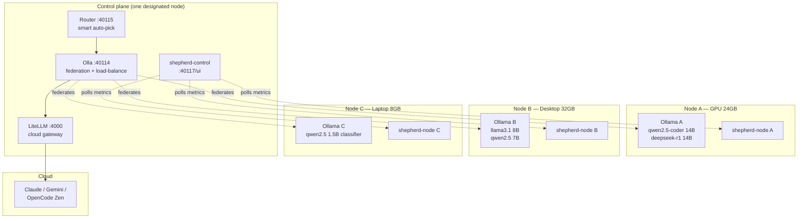

# ai-stack

> **A federated, observable AI cluster for your own hardware.**

Run a full AI development stack — local LLMs, cloud augmentation, smart routing, and a live observability dashboard — on hardware you already own. No subscription, no token metering, no vendor lock-in.

[](https://github.com/growlf/ai-stack/actions/workflows/ci.yml)
[](LICENSE)
[](https://ollama.com)
[](https://opencode.ai)

---

## What is this?

ai-stack turns one or more machines into a **federated AI herd** — local models where possible, cloud where needed, with a live dashboard so you can see exactly what's running where.

- **Local-first** — models run on your GPU/CPU; Ollama handles the inference
- **Cloud-augmented** — Claude, Gemini, OpenAI, or OpenCode Zen via LiteLLM when local isn't enough
- **Smart routing** — an LLM-based classifier picks the right model for each request automatically
- **Federated** — Olla discovers peers and load-balances across the herd; each node contributes what its hardware can serve
- **Observable** — Shepherd watches every node and surfaces the herd state at a glance

---

## The Herd Vision

Every node running ai-stack is a member of a **federated AI herd**. Models live where the hardware fits; routing decisions span the herd. A 24GB GPU box runs the 14B models; a smaller box runs the 7B workhorses; a Pi-class node can contribute a classifier slot. When you send a query, the router picks the best model + Olla picks the best healthy node serving it.



> Each node serves whatever models its hardware fits. Olla federates discovery + routing. Shepherd observes the herd. Router picks the best model per query.

---

## Live Dashboards

Once running, open these in your browser:

| Dashboard | URL | What you see |
|-----------|-----|--------------|
| **Shepherd** (herd observability) | `http://<control-host>:40117/` | Live per-node CPU/RAM/GPU + resident models + federation peers across the herd |
| **Router gestalt** | `http://<control-host>:40115/gestalt/ui` | Live routing decisions, model usage, SSE feed |
| **LiteLLM admin** | `http://<control-host>:4000/ui` | Cloud model usage, costs, API keys |
| **Olla endpoint health** | `http://<control-host>:40114/internal/status/endpoints` | Federation peer health |

### Shepherd herd dashboard

Shepherd is the herd's observability layer — a per-node sidecar (`shepherd-node`) reports system + hardware + Ollama state every few seconds, and a central control plane (`shepherd-control`) aggregates the herd into one live view. Each node appears as a card showing:

- Hardware vendor + accelerator (NVIDIA GPU, Intel Arc/Iris, AMD ROCm, Apple Silicon, or CPU-only — auto-detected via probe adapters)
- CPU / RAM / network gauges
- Resident models + warm-state from Ollama
- Federation peers visible via Olla

The dashboard refreshes via Server-Sent Events as state changes. When a model warms, when a node drops off the mesh, when a peer joins — the dashboard reflects it within seconds.

### Router gestalt view

The router view (`/gestalt/ui`) shows a live feed of every routing decision — which model was selected, which node it was sent to, and why — as it happens. Send a query from OpenCode and watch the entry appear within a second.

> **To see these in action:** `docker compose up -d --build` → open the Shepherd dashboard → send a query from OpenCode → watch the routing decision appear in the gestalt view simultaneously.

---

## Architecture

```
 OpenCode (AI IDE + Obsidian plugin)
     │
     ├── tool ──▶  Retriever :42000      Obsidian vault RAG (hybrid BM25 + vector)
     │
     ├── provider ▶  Router :40115       LLM-based smart model classifier
     │                   │
     │               Olla :40114         Federation + load balancer
     │                   │
     │           ┌───────┴────────┐
     │         Ollama          LiteLLM
     │         :11434           :4000
     │       (per-node     (Claude / Gemini /
     │        local GPU)    OpenCode Zen)
     │
     └── provider ▶  LiteLLM :4000       Direct cloud access (optional)

 Shepherd (herd observability)
     │
     ├── shepherd-control :40117/        D3 dashboard + SSE stream to browser
     │                                   Polls each peer's /herd/metrics
     │
     └── shepherd-node :40116            Per-node sidecar — runs on every herd peer
         ├── /herd/metrics               System + hardware + Ollama + Olla snapshot
         ├── /herd/verify                Raw secondary-source data for divergence detection
         ├── /herd/schema                JSON Schema of the metrics document
         ├── /herd/capabilities          Orchestrator-facing resident-models summary
         └── /herd/healthz               Liveness check
```

---

## Quick Start

```bash
git clone https://github.com/growlf/ai-stack.git
cd ai-stack
./install.sh
```

The installer auto-detects your GPU (NVIDIA, Intel Arc, or CPU-only), creates `.env`, generates your API key, and starts the stack. Open `http://localhost:40117/` (Shepherd dashboard) when it completes.

To add cloud models (Claude, Gemini, OpenCode Zen) after install:
```bash
echo 'ANTHROPIC_API_KEY=sk-ant-...' >> .env
echo 'GEMINI_API_KEY=AI...' >> .env
echo 'OPENCODE_ZEN_API_KEY=sk-...' >> .env
docker compose restart litellm
```

**[Full install guide → docs/install.md](docs/install.md)**

---

## Services

| Service | Port | Purpose |
|---------|------|---------|
| **Ollama** | 11434 | Local LLM inference (CPU / CUDA / Arc / Iris / ROCm) |
| **LiteLLM** | 4000 | Cloud API gateway (Claude, Gemini, OpenAI, OpenCode Zen) |
| **Olla** | 40114 | Federation + load balancer across herd nodes |
| **Router** | 40115 | Smart model classifier + routing dashboard |
| **Retriever** | 42000 | Obsidian vault RAG — hybrid BM25 + vector search |
| **Shepherd-node** | 40116 | Per-node observability sidecar (runs on every herd peer) |
| **Shepherd-control** | 40117 | Central dashboard + herd aggregator (runs on one designated node) |

---

## Smart Routing

The Router classifies every request and picks the right model automatically:

| Query type | Model selected |
|------------|---------------|
| Code / scripting | `qwen2.5-coder:14b` |
| Deep reasoning | `deepseek-r1:14b` |
| Long documents | `gemma3:12b` |
| Tool calling | `llama3.1:8b` |
| General chat | `qwen2.5:7b` |
| Cloud / complex | Claude / Gemini / Big Pickle via LiteLLM |

The classifier uses a tiny local model (`qwen2.5:1.5b`) to categorize queries in ~100ms before routing. Cloud models are detected by name and passed through unchanged.

---

## Shepherd — Herd Observability

Shepherd is ai-stack's observability layer — a lightweight pair of services that watches every node and surfaces the herd state at a glance. It supersedes the earlier monolithic Apostle agent with a smaller, **honest-by-construction** service: every claim the system makes about itself is cross-checked against an independent source.

### What Shepherd does

1. **Introspects** — each `shepherd-node` reads CPU, RAM, network, and hardware-accelerator state (NVIDIA via `nvidia-smi`, Intel Arc via SYCL/level-zero, AMD via ROCm-smi, etc.) and exposes a unified `/herd/metrics` JSON.
2. **Aggregates** — `shepherd-control` polls each peer's metrics every few seconds and streams the herd view to the browser via SSE.
3. **Cross-verifies** *(v0.2 / Plan v3 — in progress)* — three-source check on each node: container probe + host probe + Ollama self-report. Divergence between them surfaces as an explicit alert.
4. **Auto-recovers** *(v0.2 / Plan v3 — in progress)* — when divergence persists, attempts `docker restart` of the affected service with circuit-breaker; alerts only if recovery fails.
5. **Snapshots known-good state** *(v0.2 — in progress)* — captures kernel + driver + container digests + warm-test timing whenever the canary stays green; gives the herd a baseline to restore from rather than re-derive working configs after regressions.

### Hardware probe support

Each `shepherd-node` loads a hardware-probe adapter matching the node's accelerator. The adapter pattern is vendor-pluggable: implementing a new hardware family is one file under `shepherd/shepherd_node/probes/`.

| Hardware | Probe status |
|---|---|
| NVIDIA | ✅ implemented |
| CPU-only | ✅ implemented |
| Intel Arc | 🟡 stub — metrics pending kernel/ipex-llm work |
| Intel Iris / UHD | 🟡 stub — metrics pending |
| AMD ROCm | 🟡 stub — awaits first contributor |
| Apple Silicon | 🟡 stub — awaits first contributor |

See [`shepherd/README.md`](shepherd/README.md) for the full Shepherd service docs, endpoint reference, and contribution guide.

---

## Multi-Machine Setup (Federation)

Add remote Ollama nodes to your `.env`:

```bash
OLLAMA_REMOTE_1=http://192.168.1.10:11434
OLLAMA_REMOTE_2=http://192.168.1.20:11434
```

Then regenerate the Olla config:
```bash
scripts/generate-olla-config.sh
docker compose restart olla
```

For each remote node, also deploy `shepherd-node` so it appears on the dashboard:
```bash
# On the remote node, after cloning ai-stack:
scripts/shepherd-auto-deploy.sh node
```

The `shepherd-auto-deploy.sh` script supports a daily cron for self-updating peers — see [`docs/multi-machine.md`](docs/multi-machine.md) for the full pattern (each peer auto-pulls main + redeploys nightly, so only the canonical control node needs manual updates).

**[Multi-machine guide → docs/multi-machine.md](docs/multi-machine.md)**

---

## Roadmap

- [x] **Phase 1** — Federation + smart routing: Olla peer discovery, LiteLLM cloud gateway, Router LLM-classifier + per-tool routing
- [x] **Phase 2** — Shepherd v0.1: per-node sidecar + control-plane dashboard, vendor-pluggable hardware probes, federation-aware multi-node view
- [ ] **Phase 3** *(in progress)* — **Integrity & self-healing (Plan v3)**: in-container GPU canary, three-source divergence detection (`/herd/verify`), auto-recover on divergence with circuit-breaker, working-state snapshots per hardware adapter, latency-regression cron
- [ ] **Phase 4** — Cross-model tuning: canonical skill format + per-tool translators so OpenCode / Claude Code / Cursor / Continue / etc. share one source of truth for skills and prompts
- [ ] **Phase 5** — Herd intelligence: load-aware routing weights, proactive model pre-loading based on cluster demand, mDNS peer discovery, browser/mobile/burst-cloud participants

---

## Documentation

| Guide | Description |
|-------|-------------|
| [Install](docs/install.md) | Full setup walkthrough |
| [Getting started](docs/getting-started.md) | First steps after install |
| [Multi-machine](docs/multi-machine.md) | Connecting multiple nodes + shepherd-auto-deploy pattern |
| [Smart router](docs/smart-router.md) | How model routing works |
| [Model guide](docs/model-guide.md) | Choosing and managing models |
| [Cloud models](docs/cloud-models.md) | Configuring Claude, Gemini, OpenCode Zen, OpenAI |
| [Hardware](docs/hardware.md) | GPU setup (Arc, NVIDIA, AMD, CPU) |
| [Shepherd service](shepherd/README.md) | Observability layer — architecture + endpoints + probe contribution |
| [Troubleshooting](docs/troubleshooting.md) | Common issues and fixes |

---

## Contributing

Issues and PRs welcome. See [CONTRIBUTING.md](CONTRIBUTING.md) for guidelines and [SECURITY.md](SECURITY.md) for responsible disclosure.

**Especially welcome:** hardware-probe implementations for non-NVIDIA accelerators. The Shepherd probe-adapter interface is the extension surface — one file per hardware family. See [`shepherd/README.md`](shepherd/README.md) for the contribution pattern.

---

## License

MIT — use freely, build freely.
